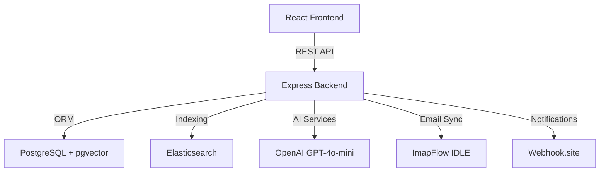

# InboxSync – Email Aggregator with AI

A personal email aggregator with real-time IMAP sync, full-text search, AI categorization, webhook notifications, and RAG-powered suggested replies.

> **Note:** This project started as a take-home assignment and is now maintained as a personal project for further learning and feature additions.

## 🌟 Overview

| Layer      | Technology                    |
|-----------|-------------------------------|
| Backend   | Node.js, TypeScript, Express  |
| Database  | PostgreSQL + pgvector         |
| Search    | Elasticsearch                 |
| Email Sync| ImapFlow (IDLE)               |
| AI        | OpenAI GPT-4o-mini            |
| Frontend  | React, TypeScript, Vite, Tailwind |

### 🎯 Project Timeline

- **Real-time IMAP sync** – Connect multiple accounts, 30-day history, IDLE for new mail
- **Elasticsearch search** – Full-text search across subject, body, sender; filter by account, folder, category
- **AI categorization** – Auto-classify into: Interested, Meeting Booked, Not Interested, Spam, Out of Office
- **Webhooks** – Notify external systems when emails are marked “Interested” (with retries)
- **React frontend** – Email list, filters, search, category stats, AI reply suggestions
- **RAG suggested replies** – pgvector + training examples for context-aware reply suggestions

### 🎨 Modern React Interface
- **Real-Time Updates** – Live email list synchronization
- **Responsive Design** – Seamless experience across devices
- **Intuitive Filtering** – Easy navigation and search

---

## 🏗️ Technology Stack



| Layer | Technology | Purpose |
|-------|-----------|---------|
| **Frontend** | React + TypeScript | Dynamic, type-safe UI |
| **Backend** | Node.js + Express + TypeScript | Scalable REST API server |
| **Database** | PostgreSQL + pgvector | ACID compliance + vector search |
| **Search Engine** | Elasticsearch | Full-text search (<100ms) |
| **Email Protocol** | ImapFlow (IDLE mode) | Real-time synchronization |
| **AI/ML** | OpenAI GPT-4o-mini | Email classification & replies |
| **Notifications** | Webhooks | External event triggers |

---

## 📋 Prerequisites

Before you begin, ensure you have the following installed:

- Docker & Docker Compose
- Node.js 20+
- OpenAI API key (for categorization and RAG)
- IMAP credentials (e.g. Gmail App Passwords)

## 🚀 Quick Start

### 1. Clone and install

```bash
git clone <your-repo-url>
cd <project-folder>
npm install
cd frontend && npm install && cd ..
```

### 2. Environment

```bash
cp .env.sample .env
# Edit .env: DATABASE_URL, OPENAI_API_KEY, WEBHOOK_URL (optional), IMAP_* for sync
```

### 3. Database and services

```bash
docker-compose up -d
npx prisma migrate deploy
npx prisma db seed   # optional: sample emails + RAG examples
```

### 4. Run

```bash
# Backend
npm run dev

# Frontend (another terminal)
cd frontend && npm run dev
```

- API: http://localhost:3000  
- App: http://localhost:5173  

## 📁 Project structure

- `src/` – Express API, routes, controllers, services (IMAP, Elasticsearch, AI, webhook, RAG)
- `frontend/` – React app (Dashboard, email list/detail, filters, search, stats)
- `prisma/` – Schema, migrations, seed

## 🔮 Roadmap

Ideas for future improvements:

- [ ] Expose IMAP connect/disconnect via API or startup from env
- [ ] More email routes (get by id, by folder, global stats)
- [ ] Real-time UI updates (e.g. WebSocket or polling) when new mail arrives
- [ ] Multiple accounts management from the UI
- [ ] Custom categories and rules
- [ ] Better RAG UX (manage training examples in the app)

## 📄 License

ISC
